# Tutorial Docker

## Crear una imagen
Cuando ya tenemos una aplicación hecha, primero tenemos que hacer un `Dockerfile` con las instrucciones para crear la imagen del container de nuestra aplicación.

Para crear la imagen del container de nuestra app corremos `docker build -t getting-started .` donde en este caso le estamos asiganando el tag (nombre) `getting-sarted` a la imagen y le estamos indicando que busque en el directorio en que estamos parados el Dockerfile. Este paso se muestra a continaución:
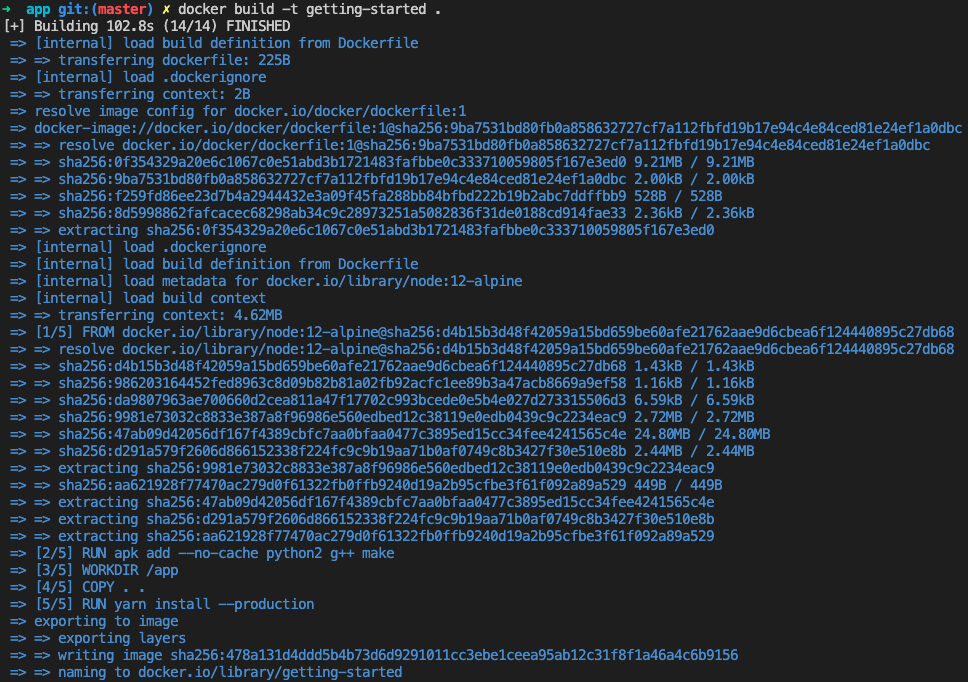

## Correr el contenedor
Luego para correr la aplicación en un container a partir de la imagen lo hacemos como se ve a continuación:
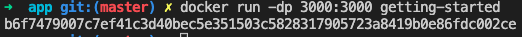
Donde se está corriendo con la flag `d` para que no quede corriendo en la consola. La flag `p` es para mapear los puertos de la máquina en que se está corriendo docker a los puertos del contanier. En este caso estamos mapeando el puerto 3000 de la máquina al puerto 3000 del container.

## Actualizar imagen y container
Si se le hacen cambios a la aplicación se deberá construir una nueva versión de la imagen. Para esto usamos el mismo comando que usamos para crear la imagen:
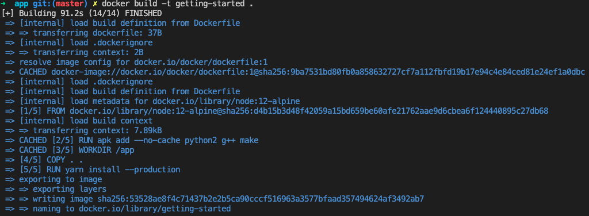

Pero antes de correr un contenedor de la nueva imagen hay que detener y borrar el container antiguo ya que sigue haciendo uso del puerto. Primero detenemos la ejecución del container con:
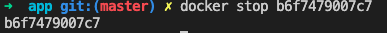

Y luego lo eliminamos con:

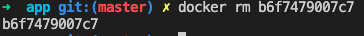

Una vez hecho eso podemos correr el container de la imagen de la app actualizada con el mismo comando que corrimos el container original.

## Publicar imagen
Primero, se debe crear un repositorio en dockerhub. Luego, cambiamos el nombre de la imagen con: `docker tag getting-started sebacarrasco/getting-started` donde `sebacarrasco` es el nombre de usuario en dockerhub y `getting-started` es el nombre del repositorio creado en dockerhub. Con eso podemos publicar la imagen en dockerhub con:
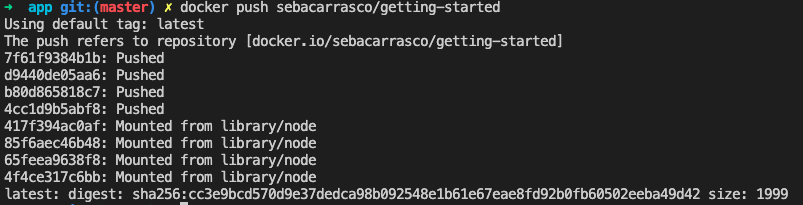

Para probar que la imagen es realmente accesible por cualquiera se puede probar en Play-with-docker, donde se correría de igual forma en que se correría en nuestro computador, pero se está corriendo en otra máquina:
dockerhub.
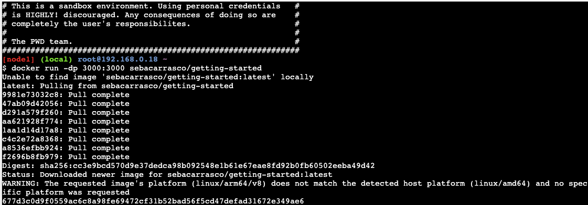

## Persistir información
Como los archivos modificados por un container solo son accedibles desde él y no persisten cuando se detiene el contenedor, entonces tenemos que crear un volumen para persistir la información de, por ejemplo, una base de datos:
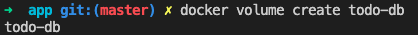

En este caso estamos poniendole `todo-db` al volumen. Los volúmenes estarán en la máquina que corre el contenedor y por lo tanto su data no se perderá cuando se modifique un contenedor y podrá ser accesible por múltiples contenedores. En este caso en particular estamos creando un named volume y dónde persiste lo define docker.

Como en la aplicación de ejemplo la base de datos se almacena en el directorio `/etc/todos`, entonces montaremos el volumen creado en ese directorio para que persistan esos archivos. Esto lo hacemos con la flag `v`:
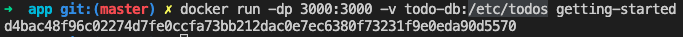

## Container para entorno de desarrollo

Para tener un container para un entorno de desarrollo (no queremos construir una imagen y correr un container para cada cambio que hagamos en el código fuente) tenemos que usar bind mounts, que nos permitirá montar nuestro código fuente en el container como un volúmen, por lo que el container percibirá los cambios que hagamos. A continuación se ve cómo corremos un container de node en donde estamos montando el código que tenemos en el directorio en que estamos parados sobre el directorio /app del contenedor.
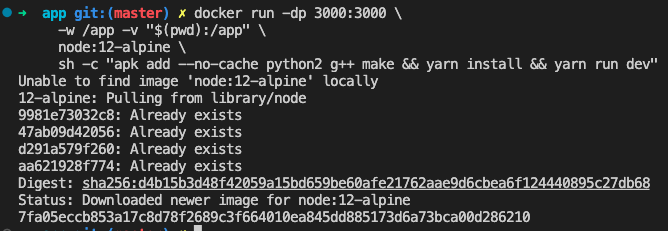

## Container Networking

Si queremos que dos containers se comuniquen, tenemos quehacer que estén en la misma red. Para eso primero tenemos que crear una red:

Para correr un container y añadirlo a una red lo hacemos con la flag `netwotk` y para añadirle un alias al container dentro de la red lo hacemos con la flag `netwotk-alias`. Esto lo podemos ver en el siguiente comando en el que también se definen algunas variables de entorno para el container de MySQL:
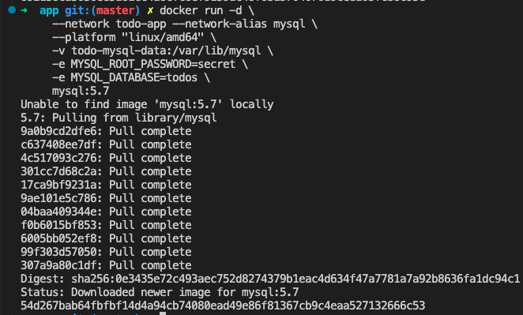

La gracia de lo anterior es que para conectarnos a un container que esté en la misma red, podemos hacerlo sin una dirección ip explícita, sino que simplemente usando el alias que le dimos al container al que nos queremos conectar. Eso lo vemos en el siguiente comando en que pasamos el nombre del host al container de la app mediante una variable de entorno:
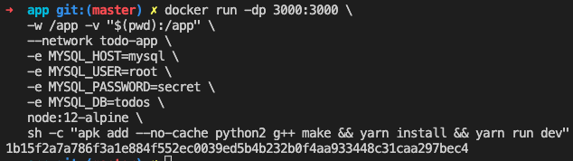

## Docker Compose

Para evitar tener que correr cada container con un comando (que puede ser largo por cierto) distinto es que llega al rescate docker-compose. Mediante un archivo docker-compose.yml podemos definir volúmenes y servicios (un servicio es un container y el nombre del servicio será el alias que tenga en la red que crea por defecto docker-compose). Además, de lo anterior, permite definir todo lo que uno podría definir en un Dockerfile (puertos, variables de entorno, comandos, etc). Un ejemplo de este archivo se encuentra en `./getting-started/app/docker-compose.yml`.

Para correr la aplicación definida en el docker-compose.yml con todos sus servicios (containers) se hace de la siguiente manera:
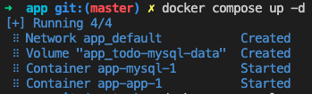

Y luego podemos ver los logs de los distos servicios como se muestr acontinuación:
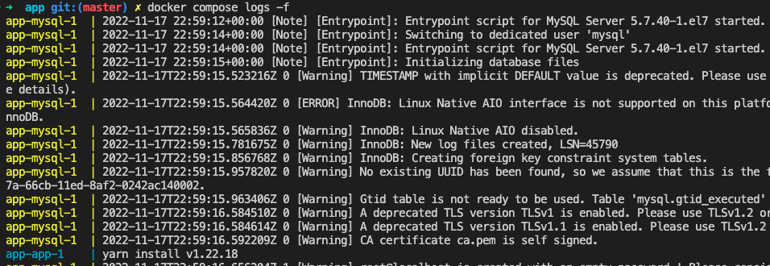

Para detener y eliminar los containers y la red se hace la siguiente forma (se están eliminando también los named volumes):
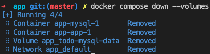

## Escaneo de seguridad

Podemos escanear una imagen para buscar vulnerabilidades de seguridad de la siguiente forma:
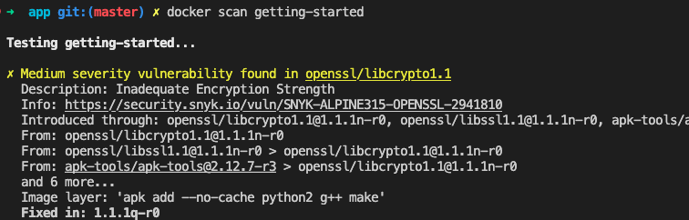

## Capas de una imagen

Podemos ver los comandos que crearon cada capa de una imagen de la siguiente forma:
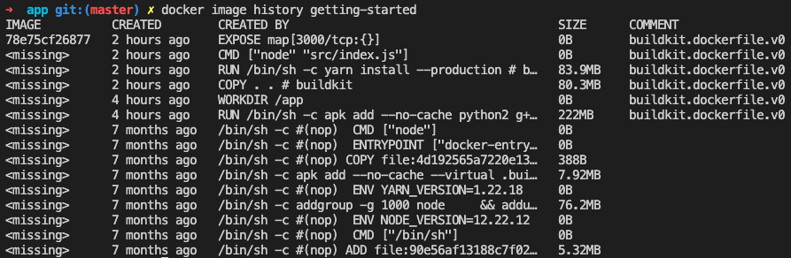

## Usando caché de capas

Para que no siempre se instalen todas las dependencias con cualquier cambio en la imagen (por ejemplo los node_modules) lo que se puede hacer en el Dockerfile es primero copiar el package.json (donde están definidas las dependencias), instalar las dependencias y luego copiar el resto de archivos. Esto, junto con poner `node_modules` en un `.dockerignore` permite que cuando hagamos un build de la aplicación en que no hayan cambiado las dependencias, estas se tengan en caché, haciendo que sea más rápido el build. Esto se puede ver a continuación:
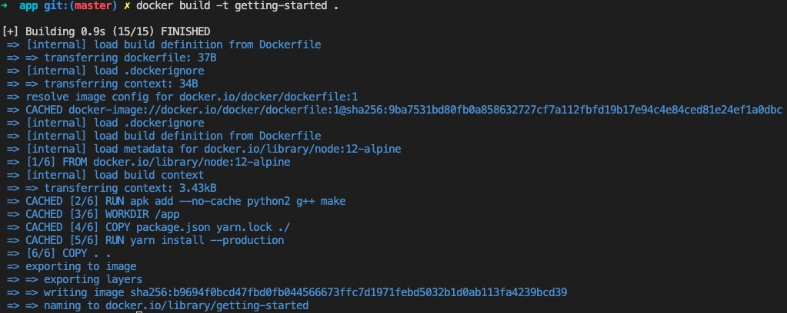

# Tutorial Docker-GoLang

## Build de la imagen

Si tenemos una aplicación en Go, lo primero que tenemos que hacer para dockerizarla es hacer el Dockerfile.

Como se ve en el archivo `docker-gs-ping/Dockerfile` definimos la versión de Go a utilizar, copiamos a la imagen `go.mod` y `go.sum`, luego descargamos las dependencias en la imagen. Después copiamos a la imagen los archivos .go, hacemos el build de la app, exponemos el puerto a utilizar y definimos que se ejecute el build cuando se hace start de un container con esta imagen.

Una vez hecho lo anterior podemos hacer el build de la imagen asignándole un tag de la siguiente forma:
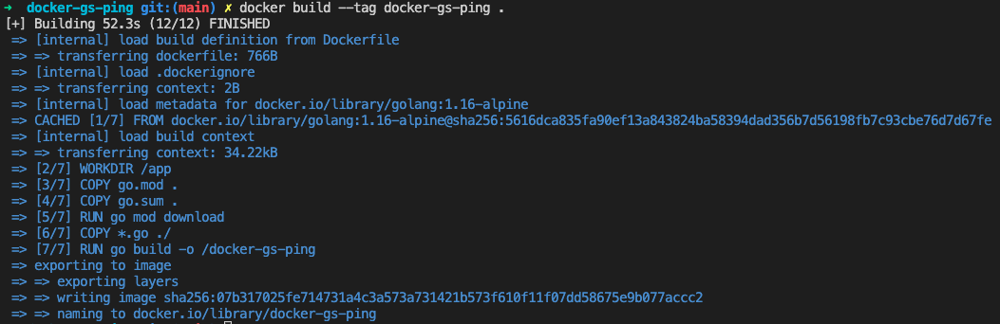

Podemos agregar y eliminar tags de una imagen:
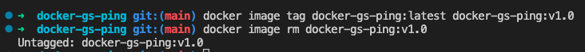

## Multistage Build
El dockerfile permite configurar build multistage, para que la imagen se construya de forma diferente dado a que se está haciendo, por ejemplo, en producción o en desarrollo. Un ejemplo de dockerfile que hace esto está en `docker-gs-ping/Dockerfile.multistage`. Para hace el build de la imagen con este nuevo dockerfile (nótese que el archivo no se llama directamente `Dockerfile`) se hace de la siguiente manera:
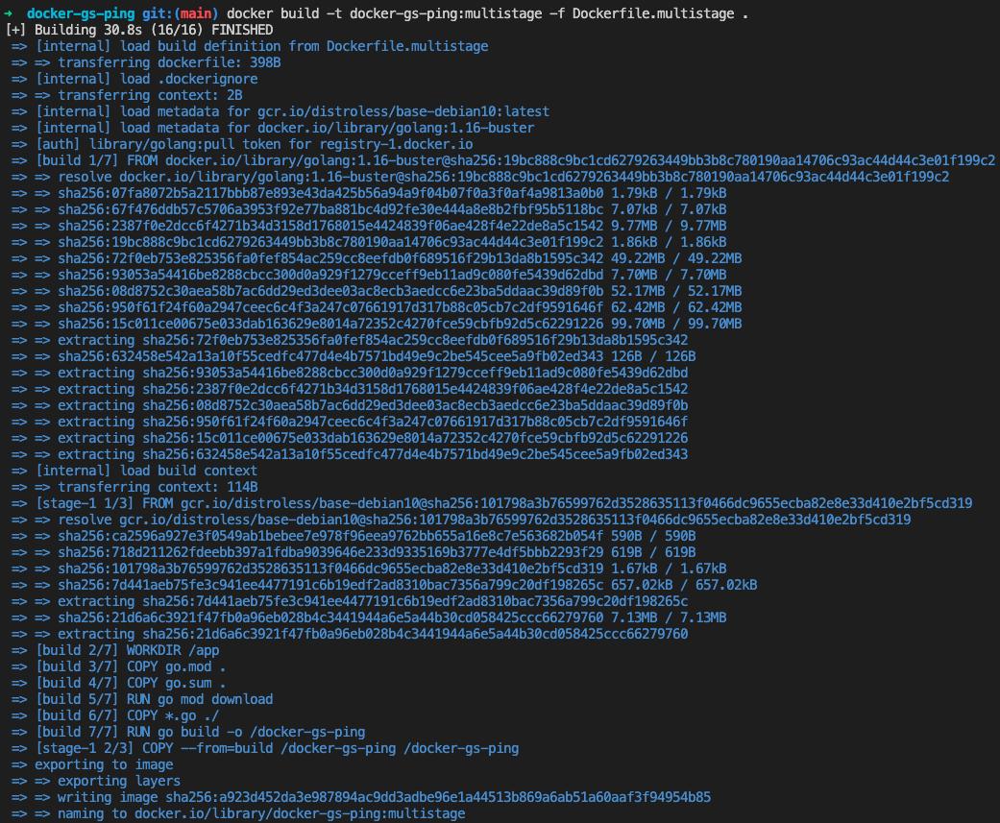

Vemos que los tamaños de los builds de las imágenes son muy diferentes:
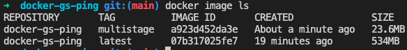

## Correr el container de la imagen
Para correr el container de la imagen de la aplicación de go lo hacemos de la siguiente forma en que se especifica que el puerto 8080 del container va a estar mapeado al puerto 8080 de nuestra máquina. Luego podemos listar los containers que están corriendo y detener alguno:
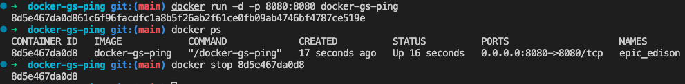

También podemos hacer restart de un container que se detuvo. Al hacer restart se hará con las mismas flags o comandos con los que se hizo start originalmente:
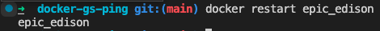

Para eliminar containers, primero estos deben estar detenidos:
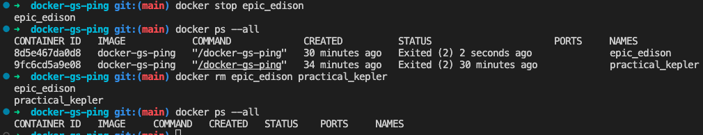

Si no se le asigna un nombre a un contenedor, docker le asignará uno aleatorio. Le podemos asignar un nombre a un container cuando lo corremos mediante la flag `--name`:

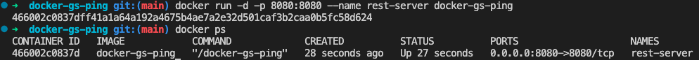

## Usar containers para desarrollo

Para añadir una base de datos en su propio container, primero tenemos que crear un volumen para persistir los datos que almacenará y crear una red que permita al container de nuestra aplicación conectarse con el container de la base de datos:
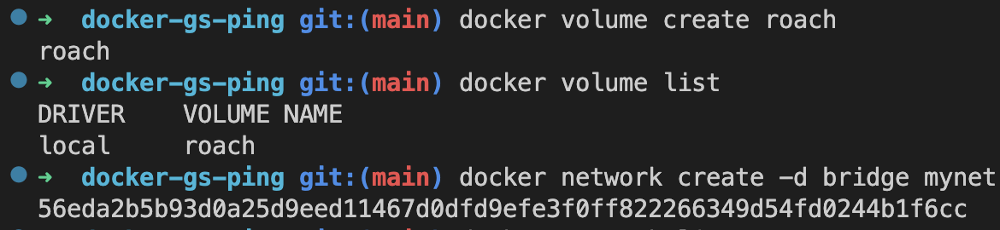

Una vez hecho eso podemos correr el contenedor de la base de datos indicando el nombre que le queremos asignar, su nombre de host, la red en la que estará, el mapeo de puertos y cómo se montará el volumen:
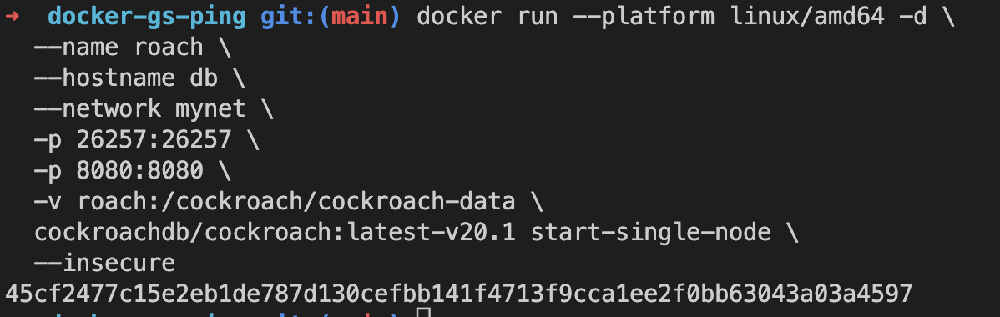

Ya corriendo el container de la base de datos podemos correr el container de la aplicación estableciendo su red, nombre, variables de entorno (entre las cuales establecimos que se conecte ala base de datos mediante el nombre que le establecimos anteriormente) y haciendo el mapeo de puertos:
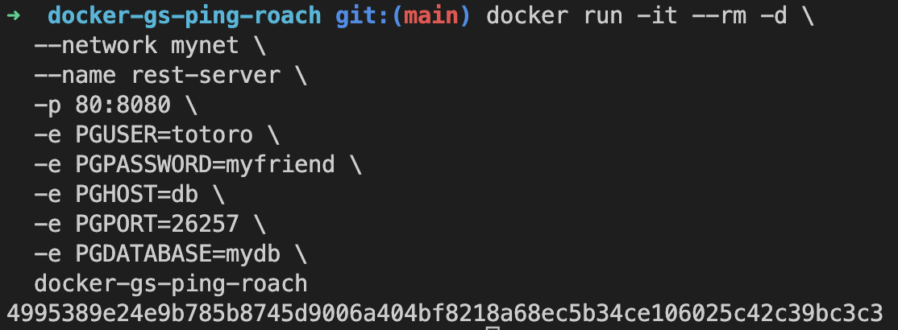

Notamos que gracias al volumen montado la información que se guarde en la base de datos persistirá incluso si eliminamos los containers y los corremos una nueva versión de ellos.

Para evitar correr comandos tan largos podemos configurar un archivo docker-compose.yml en el que podemos definir cosas como variables de entorno, el mapeo de puertos, volúmenes y todos los servicios (containers) asociados a la aplicación. Podemos chequear que el formato del docker-compose.yml sea válido con:
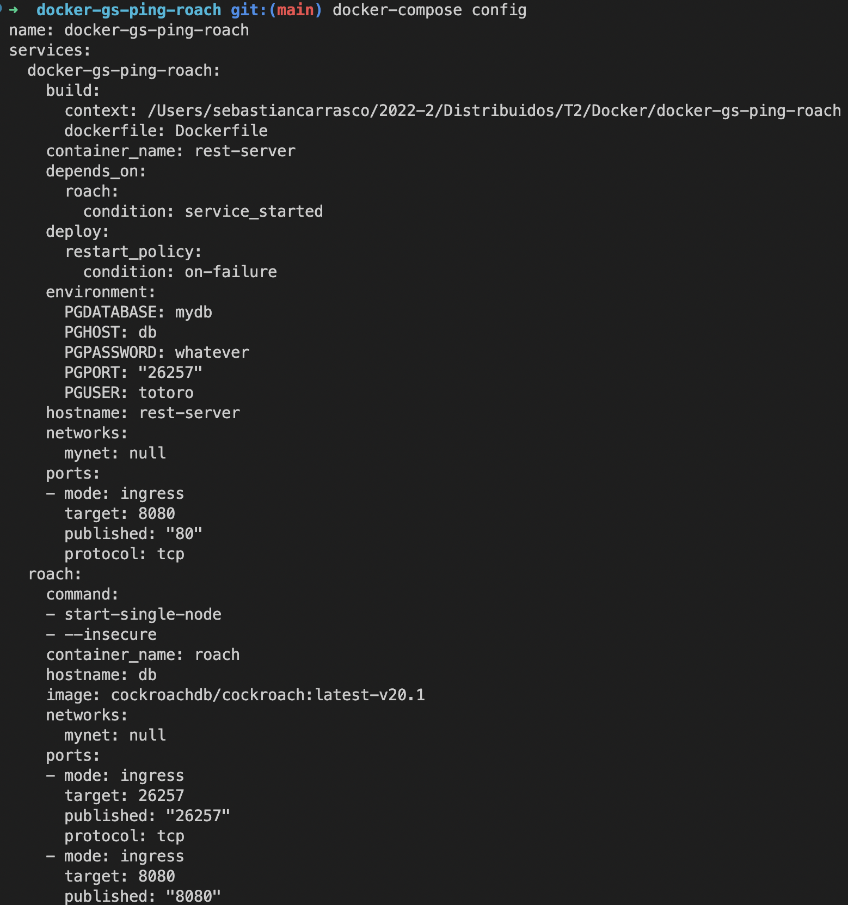

Teniendo el archivo válido podemos levantar la aplicación como se va a continuación. Es importante notar que cuando se haga un cambio en el código fuente hay que poner la flag `--build` para que se vuelva a hacer el build.
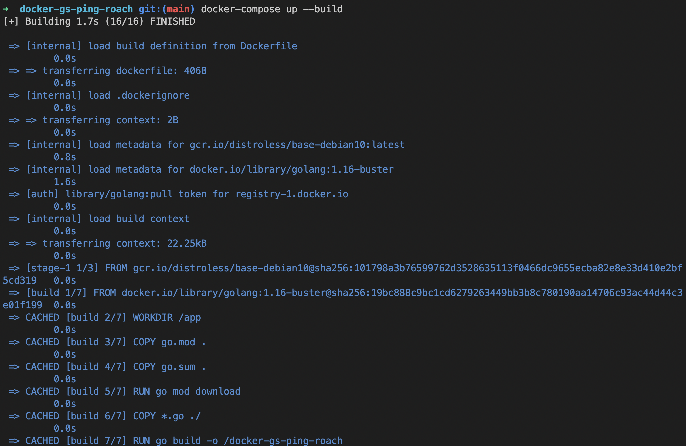

Cuando tenemos los containers detenidos (`docker-compose stop`), podemos eliminarlos todos (los declarados en el docker-compose.yml) con:
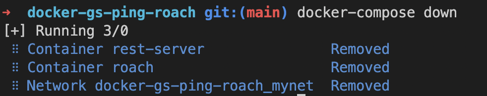

## Correr tests
Si tenemos tests como los que se encuentran en `docker-gs-ping/main_test.go` (en que notamos que cada test levanta un contenedor y espera a que esté corriendo para recién proseguir con el test) los podemos ejecutar primero haciendo el build de la imagen y luego corriendo los tests como se haría normalmente:
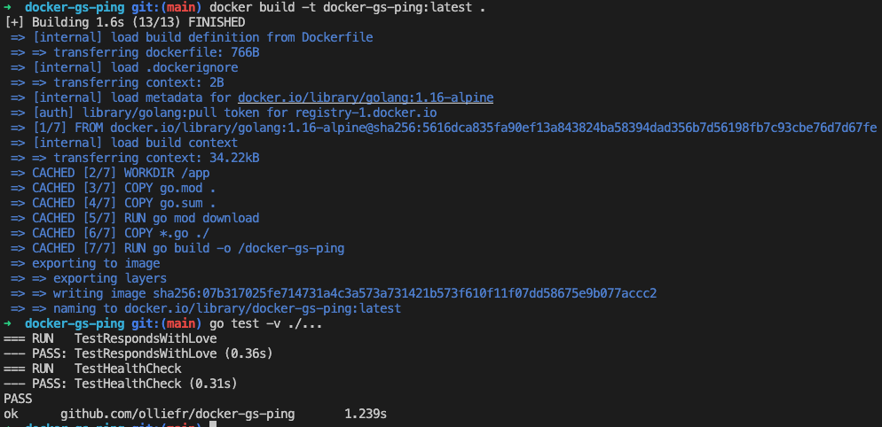

## CI/CD
Para pushear imágenes a docker con github actions: partimos por setear en el repositorio de github de la imagen un secreto con el nombre de usuario de dockerhub y otro secreto con un token de acceso para dockerhub.

Luego, hay que configurar un archivo .yml con la github action que se encargará de pushear la imagen a dockerhub. En dicho archivo se estabece bajo qué condiciones se correrá la acción, en qué máquina y qué pasos seguir. En este caso los pasos a seguir que nos interesa es tener el código del repositorio en la máquina que se ejecuta la acción, hacer login a dockerhub (con los secretos que establecimos anteriormente), hacer build de la imagen y pushearla.

Con eso, cada vez que se produzca un caso en que la acción se debe ejecutar (como por ejemplo un push a main), entonces se ejecutará una github action en la que se podrá ver que se está publicando la imagen a dockerhub. Esto se puede ver directamente desde github. Los outputs de algunos de los pasos de la acción se pueden ver a continuación:
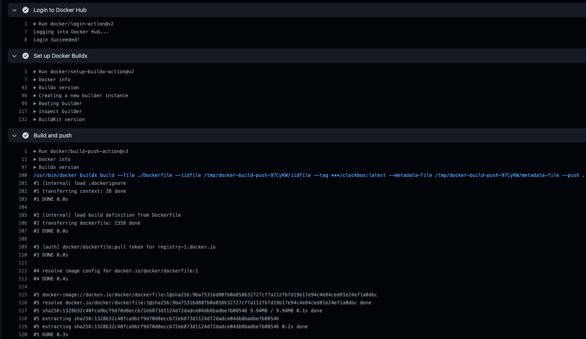

Y vemos que efectivamente se publicó la imagen en dockerhub:

directamente desde github. Los outputs de algunos de los pasos de la acción se pueden ver a continuación:
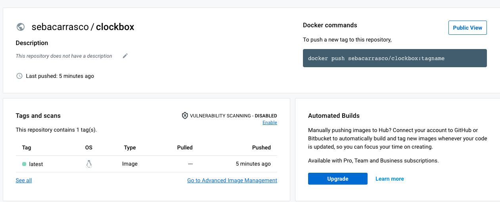

## Deploy

Para realizar el deploy de una app dockerizada existen varias opciones. Una opción es Azure Container Instances (ACI) que permite correr comandos nativos de docker o integrarse con Docker Desktop para que casi no haya diferencia entre correr los contendores en local o en producción.

Para correr contenedores en ACI, primero hay que crear un contexto de ACI y luego, al correr docker run (en nuestra máquina) basta con indicar en qué contexto queremos que se corra el contenedor con la flag `--context`. De forma similar se pueden correr aplicaciones con muchos contenedores con docker-compose. También se puede establecer en qué contexto se quiere correr comandos y de ahí en adelante correr comandos como si se estuviera en una máquina del contexto, pero corriéndolos desde nuestra máquina.

Una segunda opción es Amazon EC2 Container Service, que permite usar comandos de docker y docker-compose. Este último punto permite simplificar el desarrollo de aplicaciones con muchos contenedores.

Para correr contenedores en ECS también se debe primero crear un contexto y luego basta con especificar el contexto que se quiere usar con la flag `--conetext` al correr docker-compose desde nuestra máquina. Similar a ACI, se puede establecer en qué contexto se quiere correr comandos y de ahí en adelante correr comandos como si se estuviera en una máquina del contexto, pero corriéndolos desde nuestra máquina.

Por otro lado, Kubernetes permite la orquestación de contenedores directamente desde Docker Desktop. De hecho un cliente y servidor de Kubernetes ya vien en Docker Desktop, solo hay que habilitarlo.

Con Kubernetes se sigue la misma lógica de las dos opciones anteriores. Primero se tiene que habilitar en docker desktop y después con `kubectl` podemos cambiar de contexto entre los contextos de Kubernetes. Con Kubernetes también se debe describir la aplicación en un archivo .yaml que describirán pods (grupos de containers que comparten recursos). Luego de hacer esto, nuevamente con `kubectl` podemos hacer el deploy y luego ver los deploys hechos para asegurarnos de que todo salió bien.