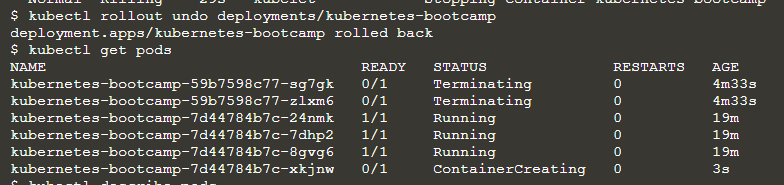

# Tutorial Kubernetes

## Crear un clúster Kubernetes.

Primero verificamos que tengamos la versión de minikube correspondiente instalada, para luego comenzar el clúster mediante `minikube start`, minikube se encarga de comenzar una máquina virtual en donde correrá un clúster simple con un solo nodo:

Para poder interactuar con Kubernetes necesitaremos kubectl que es el agente que nos permite administrar los nodos y comunicarse con el plano de control de Kubernetes, asi que chequeamos las versiones tanto del cliente como del servidor:

Con el siguiente comando podemos verificar los nodos que estan disponibles para ser usados:

## Desplegar una app.

Para crear nuestra primera app en Kubernetes utilizamos el comando `kubectl create deployment` en donde debemos señalar el nombre y la url con la ubicación de las imágenes de la app `kubernetes-bootcamp` y `--image=gcr.io/google-samples/kubernetes-bootcamp:v1` respectivamente. Este comando lo que hizo fue buscar un nodo adecuado para ejecutar la app, como el clúster era simple solo teniamos un nodo disponible que fue el que se utilizó, se programó la aplicación para ejecutarse en ese nodo y se configuró el clúster para reprogramar la instancia en un nuevo nodo si fuera necesario:

Debemos crear en una segunda terminal un proxy que se encargará de reenviar las comunicaciones a la red privada de todo el clúster, ya que kubectl interactua con la app mediante el endpoint de una API. El servidor API creará un endpoint para cada POD al que se podrá acceder mediante proxy, un POD es una abstracción de Kubernetes que representa un grupo de uno o más contenedores de aplicaciones:

## Troubleshoot Kubernetes (get, describe, logs y exec).

Verificamos que la aplicación creada se este ejecutando para ello utilizamos `kubectl get pods`, si no se encuentran PODS ejecutandose significa que estan recargando el estado anterior, por lo que podemos esperar a que se encuentren ejecutando para poder volver a enumerarlos. Luego utilizamos el comando `kubectl describe pods` que nos entrega todos los detalles acerca del contenedor del POD:

Tenemos que tener presente que los PODS se ejecutan en una red privada y aislada por lo que debemos ejecutar en una segunda terminal un proxy para poder interactuar con ellos. Ahora obtendremos el nombre del POD y consultaremos ese POD directamente a través del proxy. Para obtener el nombre del Pod y almacenarlo en la variable de entorno POD_NAME. Finalmente para ver el output de nuestra app ejecutamos una solicitud `curl` donde podremos obtener la ruta de la API del POD:

Lo que la aplicación deberia enviar normalmente a `STDOUT` se convierte en logs para el contenedor del POD, podemos recuperar estos registros mediante el comando `kubectl logs $POD_NAME`:

Una vez el POD esta en funcionamiento podemos ejecutar comandos directamente en el contenedor mediante `exec`, utilizando el nombre del POD como parámetro, realizamos una lista de variables de entorno:

Comenzamos una sesión en el contenedor del POD con `bash` en donde ejecutamos nuestra aplicación `NodeJS` verificando que se encuentre activa mediante el comando `curl`. Finalmente para terminar la conexión con el contenedor utilizamos `exit`:

## Exponer una aplicación públicamente.

Verificamos que la aplicación creada se este ejecutando para ello utilizamos `kubectl get pods`, si no se encuentran PODS ejecutandose significa que estan recargando el estado anterior, por lo que podemos esperar a que se encuentren ejecutando para poder volver a enumerarlos. Luego utilizamos el comando `kubectl get services` para listar los servicios de nuestro clúster, podemos observar que existe un único servicio llamado kubernetes que se crea de forma predeterminada cuando minikube inicia el clúster. Para crear un nuevo servicio utilizamos el comando `expose` con `NodePort` como parámetro:

Ahora con `kubectl get services` podemos ver que se creo correctamente el nuevo servicio `kubernetes-bootcamp` al cual se le asignó una IP de clúster única, un puerto interno y una IP externa, ejecutamos `describe` sobre este servicio para averiguar el puerto y asignarlo a la variable `NODE_PORT`. Ahora podemos probar que la app esta expuesta fuera del clúster usando `curl`, la IP del nodo y el puerto expuesto, recibimos respuesta del servidor por lo que sí se encuentra expuesto:

*Deployment* creó automáticamente una etiqueta para nuestro POD, utilizando `kubectl describe deployment` podemos ver el nombre de esta. Podemos utilizar esta etiqueta para consultar la lista de nuestros PODS y servicios:    

Obtenemos el nombre del POD con `export` y lo guardamos en la variable de entorno `POD_NAME`, para reenombrar el POD utilizamos el comando `label` seguido del tipo de objeto, el nombre del objeto y el nuevo nombre de la etiqueta:

Verificamos los cambios con `describe` donde podemos observar que la etiqueta se encuentra adherida al POD. Finalmente podemos consultar la lista de PODS ahora mediante la nueva etiqueta:

Para eliminar un servicio podemos utilizar el comando `delete service`, confirmamos que fue eliminado con el comando `get services` donde podemos observar que ya no se encuentra:

Para confirmar que la ruta ya no esta expuesta podemos utilizar `curl` con la IP y el puerto obtenidos previamente, lo que nos retorna el comando es prueba de que ya no se puede acceder a la aplicación desde afuera del clúster. Para confirmar que la aplicación aún se esta ejecutando podemos realizar un `curl` dentro del POD, donde podemos observar que ahí si se encuentra activa, por lo tanto si quisieramos eliminarla por completo debemos eliminar el *Deployment* también:

## Escalar una aplicación.

Con el comando `kubectl get deployments` obtenemos los *deployments*, para ver las réplicas creadas por el *Deployment* ejecutamos el comando `kubecttl get rs`. Finalmente podemos escalar estas réplicas mediante el comando `scale`:

Ahora listamos una vez más los *deployments* con el comando visto anteriormente, podemos apreciar que el cambio fue aplicado ya que ahora tenemos 4 instancias en la aplicación con distintas IPs. Finalmente con el comando `describe` podemos ver los logs de los eventos que acabamos de ejecutar:

Debemos verificar que el servicio equilibra la carga del tráfico, para averiguar la IP y puertos expuestos utilizamos `describe`, guardamos el valor del puerto en la variable de entorno `NODE_PORT`, con estos valores podemos ejecutar `curl` con la IP y el puerto encontrados. Llegamos a un POD diferente con cada solicitud, lo que demuestra que el equilibrio de carga está funcionando:  

Si queremos reducir el servicio a 2 réplicas utilizamos el comando `scale` nuevamente, enumeramos con `get` los *deployments* para verificar si se aplicaron los cambios, donde podemos observar que efectivamente ahora tenemos solo 2 réplicas. Finalmente ocupamos `get pods` lo que confirma que se cancelaron 2 pods:

## Actualizar una aplicación.

Listamos los *deployments* y los PODS con sus comandos respectivos. Para ver la versión de imagen actual de la aplicación ejecutamos `describe pods` y buscamos el campo `Imagen`: 

Para actualizar la imagen de la aplicación a la versión 2 utilizamos el comando `set image` seguido por el nombre del *deployment* y la nueva versión de la imagen. El comando se encarga de notificar a la implementación de que utilice una imagen diferente para la aplicación y comenzó una actualización continua. Verificamos el estado de los PODS con `get` y podemos observar que el anterior termina:

Verificamos que la aplicación se este ejecutando, buscamos el puerto y la IP expuesta ejecutando `describe service`, guardamos el puerto del nodo en la variable de entorno `NODE_PORT`, luego ejecutamos `curl` con el puerto y la IP encontradas. Cada vez que se ejecute el comando `curl` se accederá a un POD diferente(todos estos ejecutan la versión 2):

Podemos confirmar la actualización mediante el comando `rollout`. Finalmente con el comando `describe pods` podemos visualizar la versión de imagen actual de la aplicación en donde en el campo `Image` se aprecia que se está ejecutando la última versión 2:

Realizamos otra actualización con una imagen etiquetada con versión 10, utilizamos `get deployments` para ver el estado de cada uno y luego `get pods` para enumerar todos los PODS, podemos notar que un POD tiene un estado `ImagePullBackOff`.

Para obtener más información del error utilizamos el comando `describe pods` donde podemos ver en la sección de `Events` del POD afectado que la imagen versión 10 no existe en el repositorio:

Para revertir esta última implementación utilizamos el comando `rollout undo` lo cual deshace la última actualización quedándonos con la imagen versión 2. Utilizamos `get pods` para ver que existen 4 ejecutándose. Finalmente podemos utilizar `describe pods` para verificar que la implementación esta utilizando la versión 2, por lo tanto la reversión fue exitosa.
